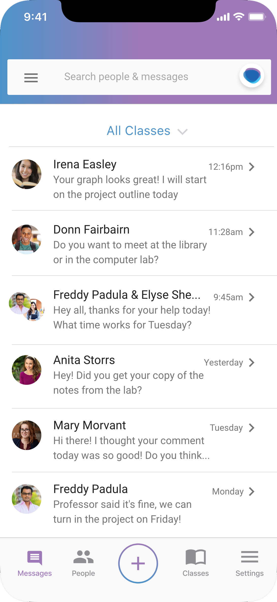

# Students can learn more by connecting with Strup

### Strup empowers students to connect and form study groups outside of class.

Strup is a messaging app for students to connect and form study groups outside of class. It removes the barrier of having to track down another student across multiple social media or email accounts. Students search by university and class to join the class group. They can see other students in their class and direct message them. They can also create study groups to collaborate with partners.

#### Find a class by university and course
Sign up with your university email and find your class to join other students

#### Send messages directly to classmates
Remove the barriers of communication and reach out directly to other students

#### Create study groups for real-time collaboration
Share your ideas with your partners, and create study groups on the fly

#### Easy messaging for iOS, Android, and Web
Strup supports every device and operating system, from phones to desktops

### Our role in the student community
Beyond personal messaging, Strup provides a Study Groups feature for group projects and collaborative work. With the ease of a group text, students can form test prep groups, lab partnerships, and much more. The app provides a more welcoming way for students to reach out and connect with each other outside of the classroom. Strup reduces social obstacles to promote open communication and improved learning outcomes.

### We want to hear from you
Have an idea for the app? Want to get involved in development? Questions for our business development team? Let’s talk!

[StrupApp.com](https://strupapp.com)

info@strupapp.com
